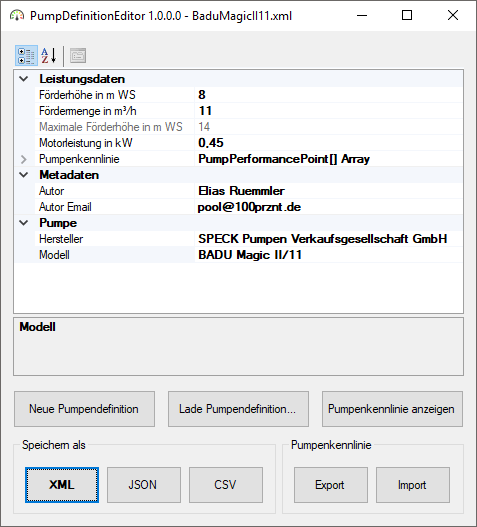
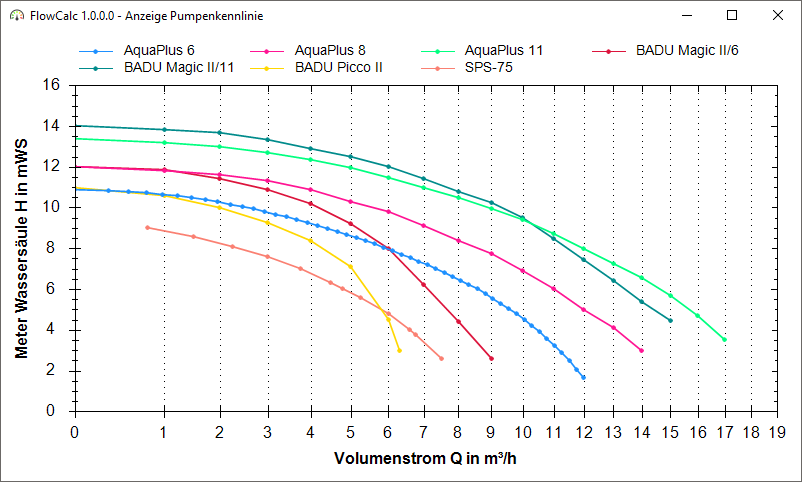

# PumpDefinitionEditor

Editor für xml-basierte Pumpedefinitionsdateien, wie sie von [FlowCalc](https://github.com/100prznt/FlowCalc) verwendet werden.

## Installation
Das Programm erfordert keine Installation. Es kann nach dem kompilieren direkt gestartet werden.

## Bedienung
TODO...

## Anwendung
### Hauptfenster


### Anzeige - Pumpenkennlinien


## Aufbau der Pumpendefinitionsdatei
TODO...

### Beispiel
```xml
<?xml version="1.0" encoding="utf-8"?>
<Pump xmlns:xsi="http://www.w3.org/2001/XMLSchema-instance" xmlns:xsd="http://www.w3.org/2001/XMLSchema">
  <Modell>AquaPlus 6</Modell>
  <Manufacturer>Aqua TechniX GmbH</Manufacturer>
  <PowerOutput>0.25</PowerOutput>
  <NominalQ>6</NominalQ>
  <NominalH>8</NominalH>
  <Author>Elias Ruemmler</Author>
  <AuthorEmail>pool@100prznt.de</AuthorEmail>
  <PerformanceCurve>
    <Ipp>
      <H>10.9</H>
      <Q>0</Q>
    </Ipp>
    <Ipp>
      <H>10.6</H>
      <Q>1</Q>
    </Ipp>
    <!-- Beliebige Anzahl weiterer Ipp-Nodes hier -->
  </PerformanceCurve>
</Pump>
```