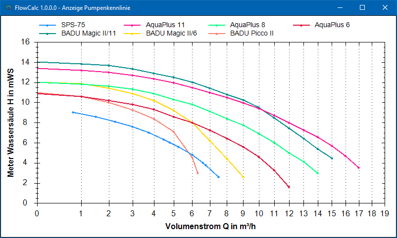
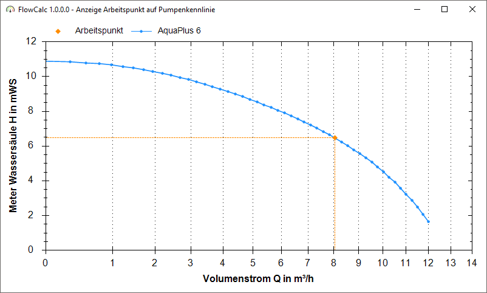
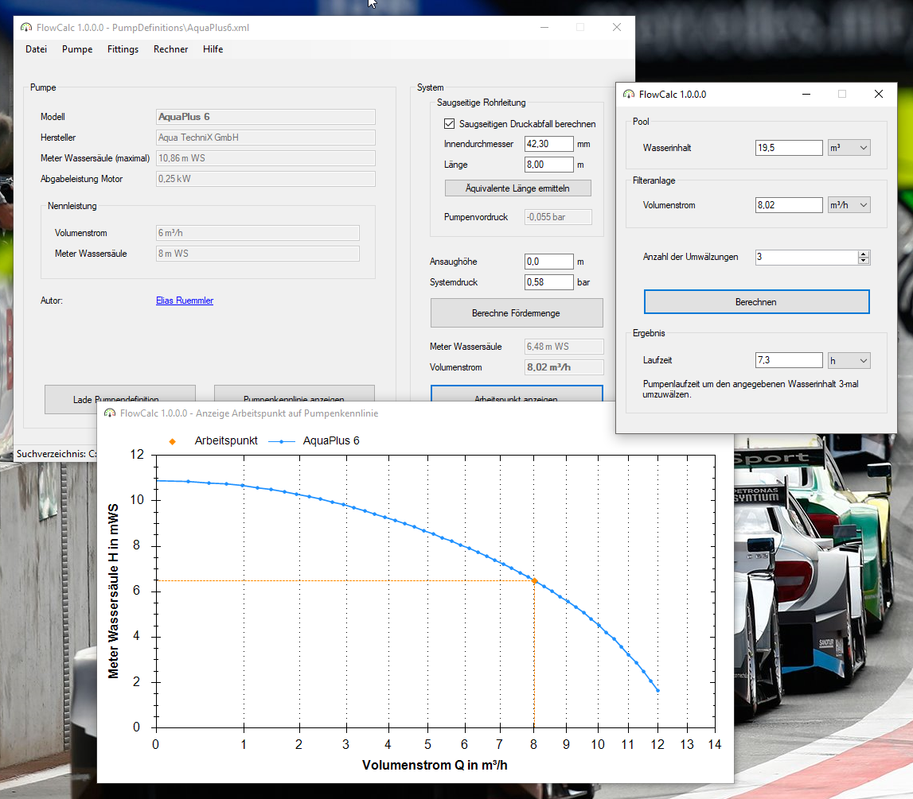
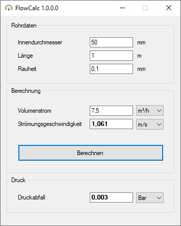
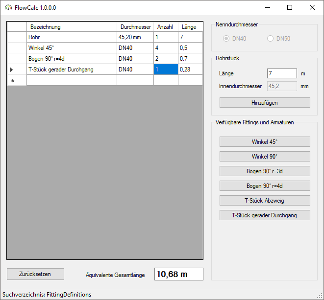

# FlowCalc

Berechnung der Fördermenge von Pool-Pumpen in Abhängigkeit des Systemdrucks und des saugseitigem Druckverlustes.

## Dokumentation
Eine vollumfängliche Dokuemntation kann ich noch nicht bereit stellen. Auf meiner Internetseite habe ich einen kleinen Artikel, zum näheren Funktionsumfang verfasst.   
[100prznt.de/FlowCalc](https://100prznt.de/pool/flowcalc/)

## Installation
Das Programm erfordert keine Installation. Es kann nach dem kompilieren direkt gestartet werden, beziehungsweise kann eine im [Release-Feed](https://github.com/100prznt/FlowCalc/releases) veröffentlichte Version herunter geladen und gestartet werden.

## Bedienung
1. Über die Schaltfläche `Lade Pumpendefinition...` muss eine gültige Pumpen-Definitionsdatei geladen werden. Unter [PumpDefinitions](https://github.com/100prznt/FlowCalc/tree/master/PumpDefinitions) finden sich einige dieser Dateien.
Siehe auch Abschnitt [Pumpendefinition](#pumpendefinition) hier im Readme.
2. Eingabe des Systemdrucks, im Feld _Systemdruck [bar]_. Dies ist der Druck nach der Pumpe, beziehungsweise vor dem Filter, Eingabe hat in __bar__ zu erfolgen.
3. Die Berechnung der Fördermenge wird mit der Schaltfläche `Berechne Fördermenge` gestartet und direkt angezeigt.

## Anwendung
### Hauptfenster


### Anzeige - Pumpenkennlinien


### Anzeige - Arbeitspunkt auf Pumpenkennlinie


### Umwälzleistung/ -zeit
Der Menupunkt ´Rechner´ -> ´Umwälzleistung´ bietet die Möglichkeit die erforderliche Pumpenlaufzeit zu berechnen. Zur Berechnung sind folgenden Angaben erforderlich:
* Wasserinhalt (Wert wird automatisch aus dem ´Poolvolumen´ Rechner übernommen)
* Volumenstrom (Wert wird aus dem Hauptfenster übernommen)
* Gewünschte Anzahl der Umwälzungen



### p-v-Q Rechner


### Äquivalente Rohrlänge Rechner


## Pumpendefinition
Das Programm benötigt zur Berechnung eine Pumpenkennlinie. Diese muss in Form einer Pumpendefinitionsdatei angegeben werden. 

### Vorhandene Pumpendefinitionsdateien
* Aqua TechniX - AquaPlus 6
* Aqua TechniX - AquaPlus 8
* Aqua TechniX - AquaPlus 11
* Speck - Badu Magic II/6
* Speck - Badu Magic II/8
* Speck - Badu Magic II/11
* Speck - Badu Picco II
* Speck - Badu Top II/8
* _Unbekannt_ - SPS-75

### Pumpendefinitionsdatei erstellen
siehe [/PumpDefinitionEditor](/PumpDefinitionEditor)

TODO...

### Beispiel
```xml
<?xml version="1.0" encoding="utf-8"?>
<Pump xmlns:xsi="http://www.w3.org/2001/XMLSchema-instance" xmlns:xsd="http://www.w3.org/2001/XMLSchema">
  <Modell>AquaPlus 6</Modell>
  <Manufacturer>Aqua TechniX GmbH</Manufacturer>
  <PowerOutput>0.25</PowerOutput>
  <NominalQ>6</NominalQ>
  <NominalH>8</NominalH>
  <Author>Elias Ruemmler</Author>
  <AuthorEmail>pool@100prznt.de</AuthorEmail>
  <PerformanceCurve>
    <Ipp>
      <H>10.9</H>
      <Q>0</Q>
    </Ipp>
    <Ipp>
      <H>10.6</H>
      <Q>1</Q>
    </Ipp>
    <!-- Beliebige Anzahl weiterer Ipp-Nodes hier -->
  </PerformanceCurve>
</Pump>
```

## Fittingdefinition
Das Programm benötigt zur Berechnung der äquivalenten Rohrlängen die entsprechenden Daten der einzelnen Fittings. Diese werden in den Fittingsdefinitionsdateien gespeichert.

### Vorhandenen Fittingsdefinitionsdateien
* Winkel 45°  DN40
* Winkel 90°  DN40
* Bogen 90° r=3d  DN40
* Bogen 90° r=4d  DN40
* T-Stück Abzweig DN40
* T-Stück gerader Durchgang DN40
* Winkel 45°  DN50
* Bogen 90° r=3d  DN50
* Bogen 90° r=4d  DN50
* T-Stück Abzweig DN50
* T-Sück gerader Durchgang  DN50

### Beispiel
```xml
<?xml version="1.0" encoding="utf-8"?>
<Fitting xmlns:xsi="http://www.w3.org/2001/XMLSchema-instance" xmlns:xsd="http://www.w3.org/2001/XMLSchema">
  <DisplayName>Winkel 45°</DisplayName>
  <Diameter>DN40</Diameter>
  <Zeta>0</Zeta> <!-- Druckverlustbeiwertes (Zeta-Wert) wird aktuell nicht berücksichtet -->
  <EquivalentLength>0.5</EquivalentLength>
  <Source>http://www.poolpowershop-forum.de/d/11110-druckanstieg-durch-armaturen-winkel-b-gen.html</Source>
</Fitting>
```

## Releases
Dieses Projekt wird auf der Continuous Integration Plattform [AppVeyor](https://www.appveyor.com/) kompiliert und im [Release-Feed](https://github.com/100prznt/FlowCalc/releases) veröffentlicht.

[](https://ci.appveyor.com/project/100prznt/flowcalc)  
[](https://ci.appveyor.com/project/100prznt/flowcalc/build/tests)

[](https://github.com/100prznt/FlowCalc/releases/latest)  
[](https://github.com/100prznt/FlowCalc/releases) (Pre-)Release


## Mitwirken

Ich bin auf der Suche nach weiteren Entwicklern für dieses Projekt. Ideeen und Verbesserungen können aus einem Fork per Pull-Request eingereicht werden.

[](https://github.com/100prznt/FlowCalc/graphs/contributors)


## Credits

* **Elias Ruemmler** - *Initial work* - [rmmlr](https://github.com/rmmlr)

Unter [Contributors](https://github.com/100prznt/FlowCalc/contributors) können weitere Projekt-Unterstützer eingesehen werden.

### Open Source Project Credits

* [csmatio](https://sourceforge.net/projects/csmatio/) .NET Library for Matlab MAT-files 
* [Newtonsoft.Json](https://github.com/JamesNK/Newtonsoft.Json) Json.NET is a popular high-performance JSON framework for .NET
* [ZedGraph](https://www.nuget.org/packages/ZedGraph/) ZedGraph is a class library, user control, and web control for .net, written in C#, for drawing 2D Line, Bar, and Pie Charts.

## Lizenz

Dieses Projekt (FlowCalc) ist lizenziert unter der [MIT Lizenz](http://www.opensource.org/licenses/mit-license.php "Read more about the MIT license form").  
Weitere Details unter [LICENSE.txt](https://github.com/100prznt/FlowCalc/blob/master/LICENSE.txt).

[](https://github.com/100prznt/FlowCalc/blob/master/LICENSE.txt) 
