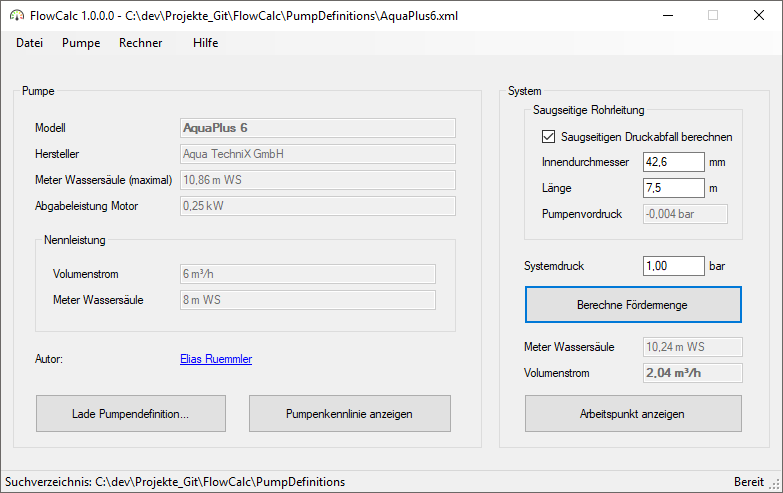

# FlowCalc

Berechnung der Fördermenge von Pool-Pumpen in Abhängigkeit des Systemdrucks.

## Installation
Das Programm erfordert keine Installation. Es kann nach dem kompilieren direkt gestartet werden, beziehungsweise kann eine im [Release-Feed](https://github.com/100prznt/FlowCalc/releases) veröffentlichte Version herunter geladen und gestartet werden.

## Bedienung
1. Über die Schaltfläche `Lade Pumpendefinition...` muss eine gültige Pumpen-Definitionsdatei geladen werden. Unter [PumpDefinitions](https://github.com/100prznt/FlowCalc/tree/master/PumpDefinitions) finden sich einige dieser Dateien.
Siehe auch [Pumpendefinition](#pumpendefinition)
2. Eingabe des Systemdrucks, im Feld _Systemdruck [bar]_. Dies ist der Druck nach der Pumpe, beziehungsweise vor dem Filter, Eingabe hat in __bar__ zu erfolgen.
3. Die Berechnung der Fördermenge wird mit der Schaltfläche `Berechne Fördermenge` gestartet und direkt angezeigt.

## Anwendung


## Pumpendefinition
Das Programm benötigt zur Berechnung eine Pumpenkennlinie. Diese muss in Form einer Pumpen-Definitionsdatei angegeben werden. 

### Aufbau der Pumpen-Definitionsdatei
TODO...

### Beispiel
```xml
<?xml version="1.0" encoding="utf-8"?>
<Pump xmlns:xsi="http://www.w3.org/2001/XMLSchema-instance" xmlns:xsd="http://www.w3.org/2001/XMLSchema">
  <Modell>AquaPlus 6</Modell>
  <Manufacturer>Aqua TechniX GmbH</Manufacturer>
  <PowerOutput>0.25</PowerOutput>
  <NominalQ>6</NominalQ>
  <NominalDynamicHead>8</NominalDynamicHead>
  <Author>Elias Ruemmler</Author>
  <AuthorEmail>pool@100prznt.de</AuthorEmail>
  <PerformanceCurve>
    <Ipp>
      <H>10.9</H>
      <Q>0</Q>
    </Ipp>
    <Ipp>
      <H>10.6</H>
      <Q>1</Q>
    </Ipp>
    <!-- Beliebige Anzahl weiterer PumpPerformancePoint Nodes hier -->
  </PerformanceCurve>
</Pump>
```

## Releases
Dieses Projekt wird auf der Continuous Integration Plattform [AppVeyor](https://www.appveyor.com/) kompiliert und im [Release-Feed](https://github.com/100prznt/FlowCalc/releases) veröffentlicht.

[](https://ci.appveyor.com/project/100prznt/flowcalc)  
[](https://ci.appveyor.com/project/100prznt/flowcalc/build/tests)

[](https://github.com/100prznt/FlowCalc/releases/latest)  
[](https://github.com/100prznt/FlowCalc/releases) (Pre-)Release


## Mitwirken

Ich bin auf der Suche nach weiteren Entwicklern für dieses Projekt. Ideeen und Verbesserungen können aus einem Fork per Pull-Request eingereicht werden.

[](https://github.com/100prznt/FlowCalc/graphs/contributors)


## Credits

* **Elias Ruemmler** - *Initial work* - [rmmlr](https://github.com/rmmlr)

Unter [Contributors](https://github.com/100prznt/FlowCalc/contributors) können weitere Projekt-Unterstützer eingesehen werden.


## Lizenz

Dieses Projekt (FlowCalcN) ist lizenziert unter der [MIT Lizenz](http://www.opensource.org/licenses/mit-license.php "Read more about the MIT license form").  
Weitere Details unter [LICENSE.txt](https://github.com/100prznt/FlowCalc/blob/master/LICENSE.txt).

[](https://github.com/100prznt/FlowCalc/blob/master/LICENSE.txt) 
